# Introduction to AWS Deep Racer - AWS Programming and Tools Meetup

## Presenters
Paul Kukiel - https://au.linkedin.com/in/paulkukiel
Cloud Architect at National Australia Bank

Chris Rhodes - https://au.linkedin.com/in/rhodeschristopher
Cloud Engineer at National Australia Bank

## Refence Links
Chris Rhodes Reinforcement overview - https://bit.ly/2IsUxz0

Run Deep Racer Locally - https://github.com/crr0004/deepracer

Udacity Deep Racer Scholarship (Ends 31 October '19) - https://www.udacity.com/aws-deepracer-scholarship

AWS Deep Racer Training ( 90 mins ) - https://www.aws.training/Details/eLearning?&search=DeepRacer&tab=view_all

## Overview
The aim of the session today is to provide a gentle introduction to machine learning.  We have heard from Chris Rhodes ( reference Chris) about how the basic mechanics of reinforcement learning works.  Now we are going to put that into practice and setup our very own simulation.

At the end of the session you will have:
- Configured the AWS resources required to run AWS DeepRacer
- Understood what the action space is and have tried a few options
- Built a reward function in python
- Selected hyper-parameters
- Began training a model
- Looked at Robomaker and Sagemaker
- Examined and reviewed the outputs and logs of your simulation
- Experienced the virtual world as a birds eye view of the AWS virtual track
- Have built a model that ( hopefully ) learns its way around a simple race track
- Had a look at the physical Deep Racer Vehicle

## Step 1: AWS Console
Logon to the AWS Console.  Ensure you are have selected the correct region: N.Virginia ( us-east-1 ).

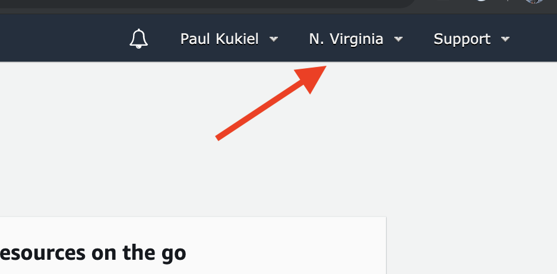

Click "Services" and type "DeepRacer" 

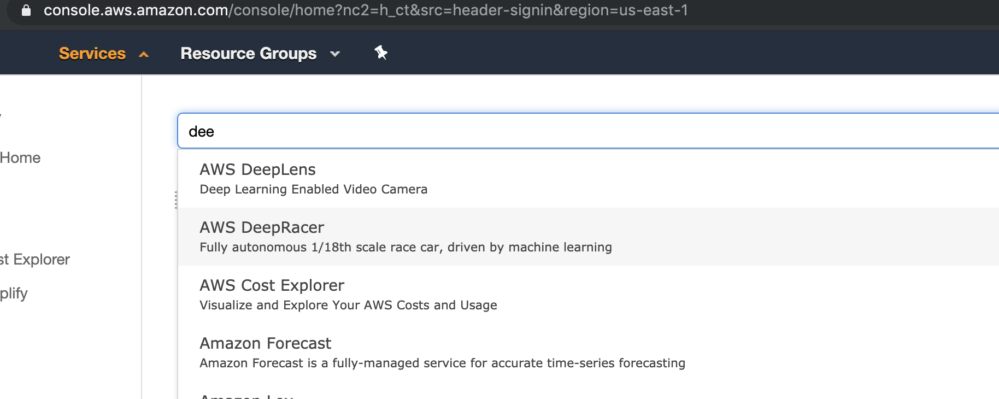

 Alternatively click -> https://console.aws.amazon.com/deepracer/home?region=us-east-1

From the AWS DeepRacer landing page, expand the pane on the left and select **Reinforcement learning.**
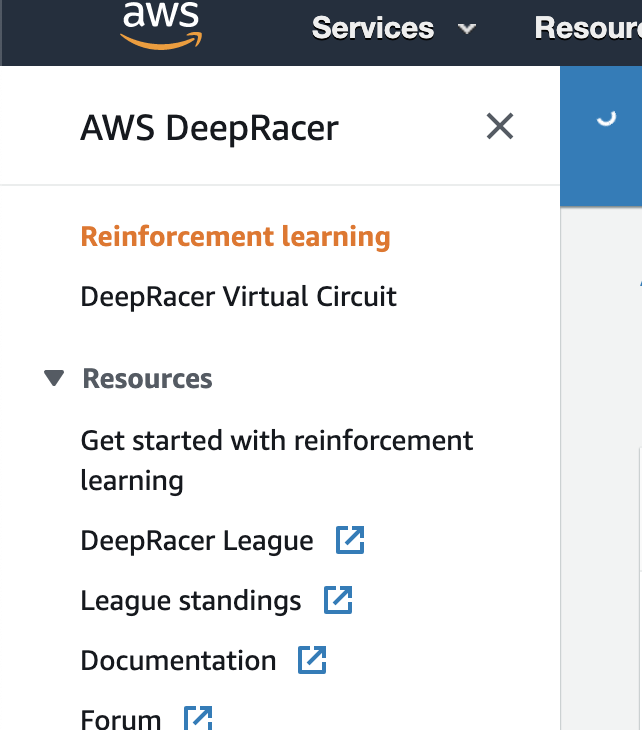

## Setup
AWS needs to create some basic infrastructure and IAM roles.  We also need an S3 bucket to store the reward function.  The roles are used to instantiate the Robomaker and Sagemaker instances.

This page gives a list of all the models you have created and each model's respective status.  As we are creating a new model click "Create Model" in the upper right corner.

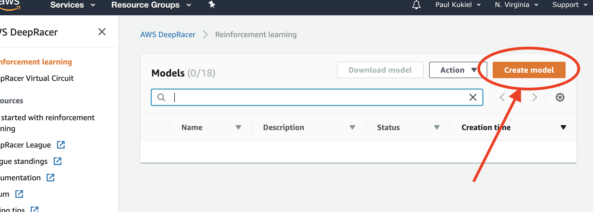

Click "Create Resources" this step can take 5-10 minutes to complete.

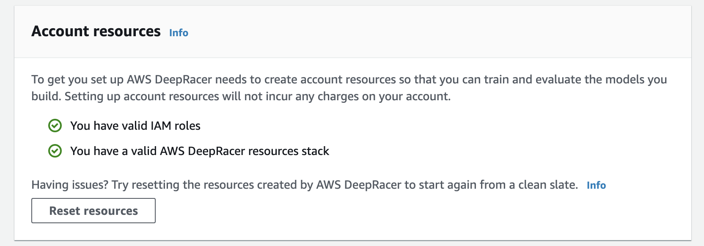

You can view the creation of the stack at the same time by opening a new tab and browsing to CloudFormation: https://console.aws.amazon.com/cloudformation/home?region=us-east-1 and clicking on the stack name.  Here you can view everything that is created.  A rough overview of the environment is shown below:

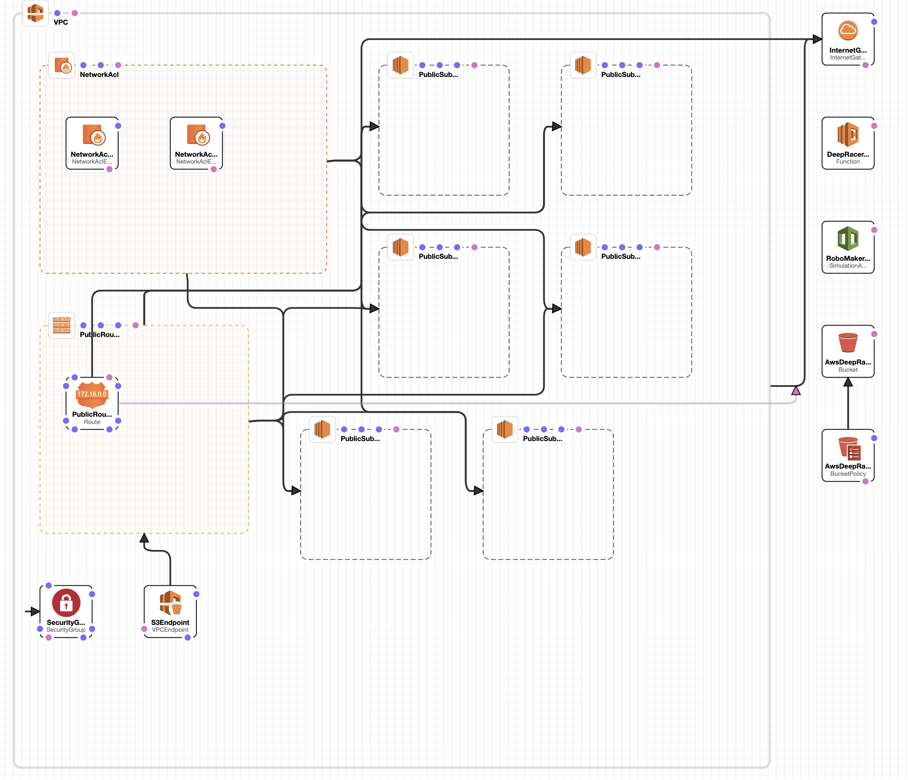

If you get stuck at this point you can try "Reset Resources" or ask someone for some assistance.

We are now ready to create a model.

## Step 2: Model Creation

Name your model.  Name is something that describes what you might attempt to accomplish.  Later we will reference the model, a model can be cloned, the reward function and hyper parameters can change but the action space cannot.  If you need to reference the model later for evaluation a Convention based name can help you understand what that model was attempted to accomplish.

[](img/model.png)

## Step 2: Environment simulation

Here we will choose a track.  The smaller and simpler the track the fast the simulation will "learn" how to drive around it.  I'd recommend the reInvent 2018 or Bow Tie track.  The track on display today is the reInvent 2018 track.


The simulated race track is the environment that the agent will explore while training the model.

To improve your chances of getting a good race time, train on a a track that most closely resembles the track you intend to race on. This will ensure that your model has the highest probability of generalizing to the race track. Furthermore, the shape of the track can also provide guidance on appropriate driving behaviour for the track, and thus help you consider the driving behaviour you want to enforce in your reward function.

## Step 3: Action Space

Action space defines the specific actions an agent can take in both the simulator and physical world. While a real vehicle can choose from a continuum of actions, AWS DeepRacer simplifies the agent's decision-making process by reducing that space to a set of discrete actions.

Configure this discrete action space by setting the range and granularity for speed and steering angle. The system automatically generates an action space according to that specification. Note that your model will take longer to train under a larger action space.

## Maximum steering angle ( range -30 to 30 degrees )
The maximum steering angle determines the range of steering angles in which the front wheels of your agent can turn. For the agent to be able to make bigger turns, set a higher maximum steering angle. However, too high a maximum steering angle can empower the agent to make unnecessarily excessive turns and can cause zig-zagging.

## Steering angle granularity ( 3 5 or 7 )
The steering angle granularity determines the number of directions your agent can steer. Increasing this will empower the agent to exercise finer control, but the larger action space will also increase the time it takes to train your model.

## Maximum speed ( Between 0.8 and 12meter per second )
The maximum speed determines how fast your agent can drive. For the agent to be able to drive faster, set a higher maximum speed. However, on a given track, you must balance the desire for speed against the concern for keeping the agent on the track while it manoeuvres curves at a high speed.

## Speed granularity ( 1 2 or 3 )
The speed granularity determines the number of speeds in which your agent can drive. Increasing this will empower the agent to exercise finer control, but the larger action space will also increase the time it takes to train your model.

The action space define the "actions" these are effectively the options that the car can take when driving around the track.  In it's most basic form the car will say. OK given I am looking at the track from the starting line I'll try turn zero degrees ( straight ), while travelling at 3 meter per second, the car will move forward.  In the next step the car will again make a choice out of the list of actions saying ok I'll try the same and see what happens. Was that choice good or bad though? Well that's where the reward function comes in.

For todays event we should select values that "should" train faster.

Steering: 30 Degrees
Steering angle granularity: 3
Maximum speed: 3.5 ms
Speed granularity: 1

It wont be fast but it should train quickly.

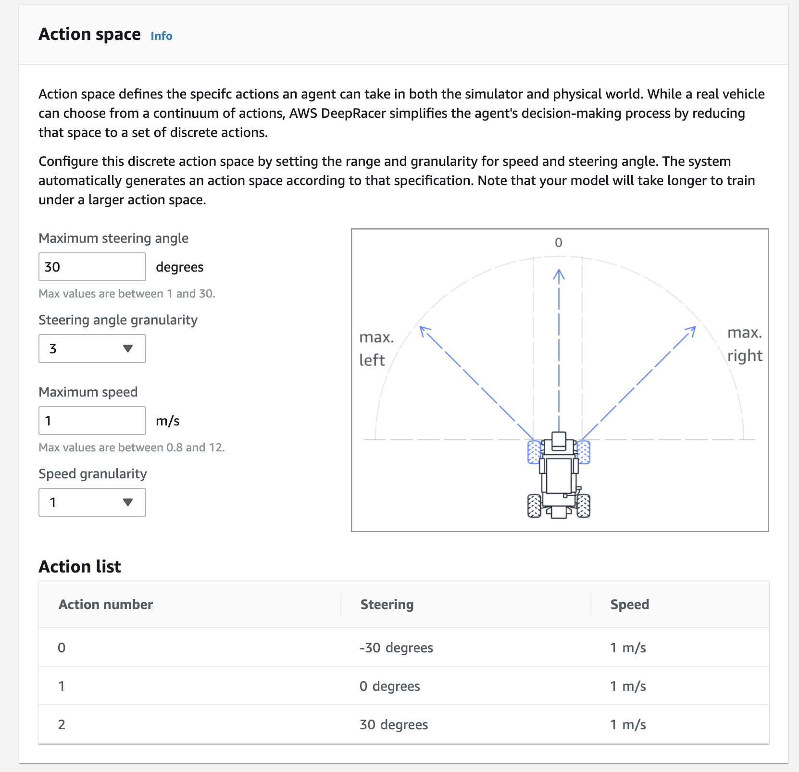


## Step 3: Reward Function
The reward function describes immediate feedback (as a score for reward or penalty) when the vehicle takes an action to move from a given position on the track to a new position. Its purpose is to encourage the vehicle to make moves along the track to reach its destination quickly. The model training process will attempt to find a policy which maximizes the average total reward the vehicle experiences.

This is the fun part.  For the programmers/data guys this is where you will excel.

Continuing from the action space the car has made a choice, but how good was that choice.  The reward function will evaluate the new state and provide reward back to the model.  

For example "Am I still on the track" No, ok reward very low.

Am I close to the a wheel going over the line? Yes, reward very low.

Am I close to the middle and going fast Yes, reward high.

We are incentivising the model to perform optimally.  Picture yourself trying to instruct a blind folded person to walk around the track, each time they take a step in the right direction you offer them a treat, each time they take a step in the wrong direction they don't receive a treat.  The faster they get around the track the more and larger treats they receive.

AWS Provides a number of "Pre-built" reward functions.  

Python is easy enough to quickly pick up and members will be around to help with syntax.  Work with your teammate or individually to come up with a reward function

scottpletcher
One of my favorites is https://github.com/scottpletcher/deepracer/blob/master/iterations/v5-Minimalist.md

From Scott Pletcher, it's very very simple but after a few hours can perform pretty well.

## Reward Function

```python
def reward_function(params):

    if params['all_wheels_on_track']:
        reward = params['progress']
    else:
        reward = 0.001

    return float(reward)
```

This function is so simple.  If you are on the track provide some reward, the further around the track the higher the reward.  If your not on the track provide a tiny reward.

## Step 4: Hyper-Parameters

Hyperparameters
Hyperparameters are variables to control your reinforcement learning training. They can be tuned to optimize the training time and your model performance.

## Gradient descent batch size
The number of recent vehicle experiences sampled at random from an experience buffer and used for updating the underlying deep-learning neural network weights. Random sampling helps reduce correlations inherent in the input data. Use a larger batch size to promote more stable and smooth updates to the neural network weights, but be aware of the possibility that the training may be longer or slower.

The batch is a subset of an experience buffer that is composed of images captured by the camera mounted on the AWS DeepRacer vehicle and actions taken by the vehicle.

## Number of epochs
The number of passes through the training data to update the neural network weights during gradient descent. The training data corresponds to random samples from the experience buffer. Use a larger number of epochs to promote more stable updates, but expect a slower training. When the batch size is small, you can use a smaller number of epochs.

## Learning rate
During each update, a portion of the new weight can be from the gradient-descent (or ascent) contribution and the rest from the existing weight value. The learning rate controls how much a gradient-descent (or ascent) update contributes to the network weights. Use a higher learning rate to include more gradient-descent contributions for faster training, but be aware of the possibility that the expected reward may not converge if the learning rate is too large.

## Entropy
The degree of uncertainty used to determine when to add randomness to the policy distribution. The added uncertainty helps the AWS DeepRacer vehicle explore the action space more broadly. A larger entropy value encourages the vehicle to explore the action space more thoroughly.

## Discount factor
The discount factor determines how much of future rewards are discounted in calculating the reward at a given state as the averaged reward over all the future states. The discount factor of 0 means the current state is independent of future steps, whereas the discount factor 1 means that contributions from all of the future steps are included. With the discount factor of 0.9, the expected reward at a given step includes rewards from an order of 10 future steps. With the discount factor of 0.999, the expected reward includes rewards from an order of 1000 future steps.


## loss type
The type of the objective function to update the network weights. A good training algorithm should make incremental changes to the vehicle’s strategy so that it gradually transitions from taking random actions to taking strategic actions to increase reward. But if it makes too big a change then the training becomes unstable and the agent ends up not learning. The Huber and Mean squared error loss types behave similarly for small updates. But as the updates become larger, the Huber loss takes smaller increments compared to the Mean squared error loss. When you have convergence problems, use the Huber loss type. When convergence is good and you want to train faster, use the Mean squared error loss type.

## Number of experience episodes between each policy-updating iteration

The size of the experience buffer used to draw training data from for learning policy network weights. An episode is a period in which the vehicle starts from a given starting point and ends up completing the track or going off the track. Different episodes can have different lengths. For simple reinforcement-learning problems, a small experience buffer may be sufficient and learning will be fast. For more complex problems which have more local maxima, a larger experience buffer is necessary to provide more uncorrelated data points. In this case, training will be slower but more stable. The recommended values are 10, 20 and 40.

## Training
For today it won't make much difference in the short time what we change here.  Many members of the community have tips and tricks.  The mode valuable I have found is to slow down the learning rate.  If you do though training will be slower.


Once you have chosen values you can specify a stop time.  This will end on the time you want to head home.  You can train more than one model at a time so perhaps set this to 45 mins.

Click "Start Training"

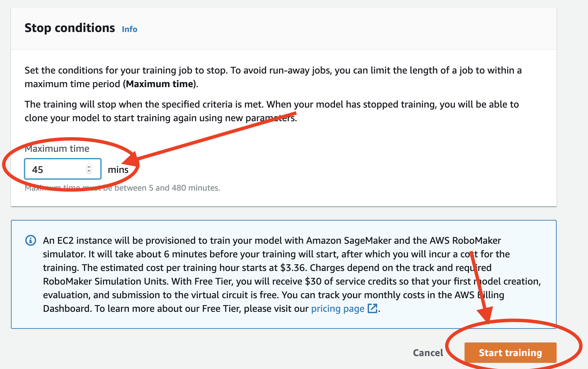

Youll notice 

A small alert.  This is starting the training.  It can take 4-10 mins to start.  It's best to wait on the page until the training starts.

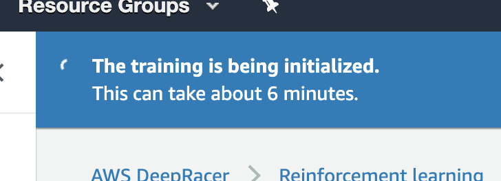

From here you will now have a video of the car as it attempts to drive around the track.  This is interesting to watch as the car learns to drive around the track.

You can also watch the reward graph over time

In a separate tab you can navigate to:

https://console.aws.amazon.com/robomaker/home?region=us-east-1#simulationJobs

You will see the Simulation job, click on the simulation and you have a view of robo maker where you can also see the video of the car in the virtual world.


Click on "Gazebo" icon 
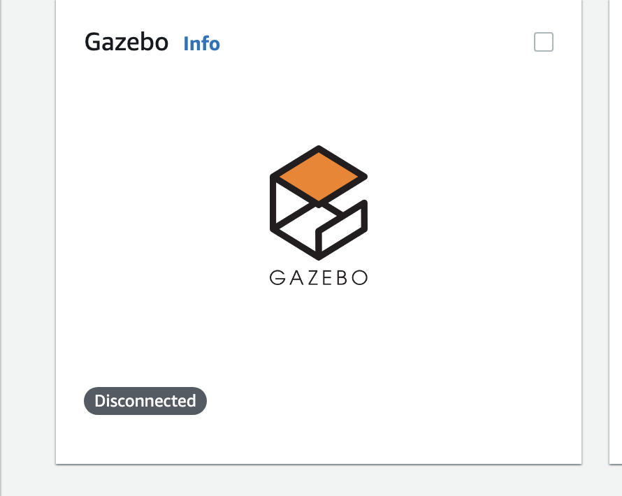

for a more "birds eye view" of the car on the track.  Explore the outputs.

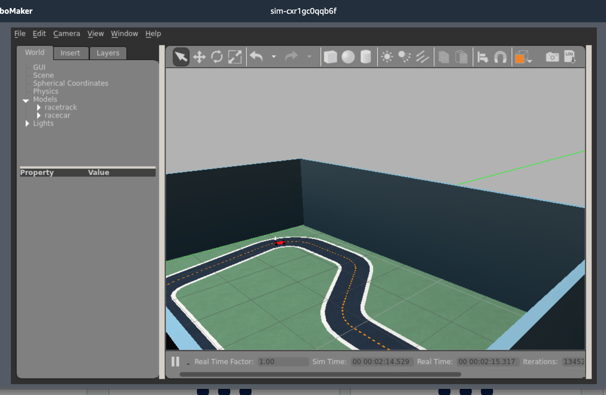

If you put debug messages in your reward function you can view them in your logs.  Scroll to the bottom of the page and click "Logs"

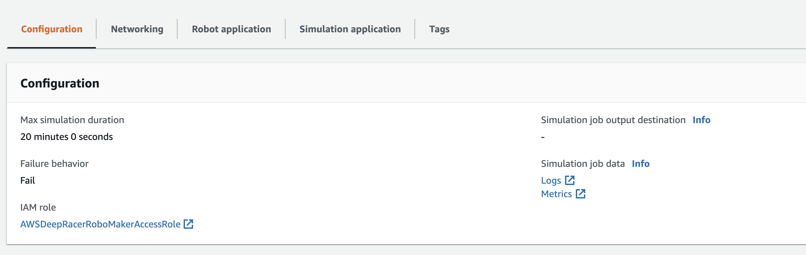

This will display the logs in cloudwatch.  You'll also be able to see the rewards and any other issues that arrise.  You will spend alot of time here.

Using the reward basic reward function, the small action space I was able to complete the track ( slowly ) with 45 mins of training.  By the end of the lesson that first model should get around the track.  You can Evaluate a model once it's completed training.

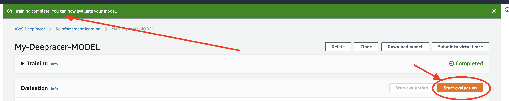

You are now free to explore!
